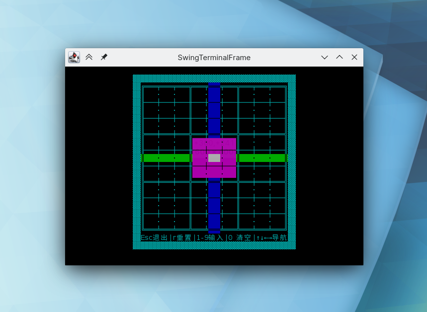
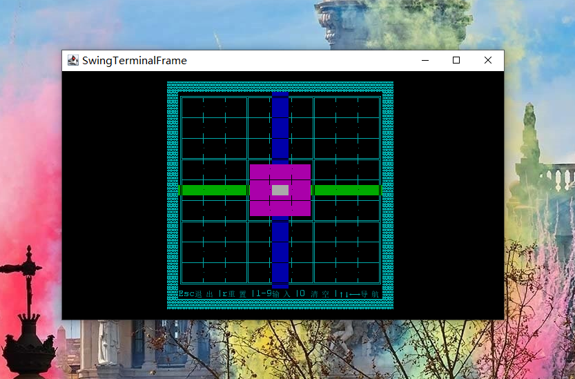

# Sudoku :diamond_shape_with_a_dot_inside:

使用了类Ncurses的终端库lanterna实现数独游戏的演示

## 作业补丁说明

lanterna会在不支持标准输出的终端下弹出一个Swing实现的终端模拟器，但这不代表这不是终端程序

一些终端模拟器不支持隐藏光标，另一些终端模拟器不支持隐秘模式下的禁用回滚，请使用面向真实用户的终端模拟器，如KDE环境下的Konsole，Gnome环境下的Gnome Terminal，或是经典的XShell。直接使用真实字符终端亦可，但仍有些特性无法得到支持

对终端的尺寸有一定要求，不满足要求会提示缩放

下面给出样例：


_在Arch Linux/KDE下使用基于Konsole的下拉终端yakuake测试，可以良好地隐藏光标，此图还展示了提示重复数字的功能_



_在Arch Linux/KDE下使用自带的fallback选项SwingTerminalFrame作为终端模拟器，字体较小但也能良好地隐藏光标_



_在Windows10下使用自带的fallback选项SwingTerminalFrame作为终端模拟器，字体较小显示模糊，能良好地隐藏光标_


_在Windows10下使用VSCode集成终端作为终端模拟器，字体清晰颜色鲜艳，不能隐藏光标_

## 目录结构

``` powershell
./
├── bin/                # 生成的debug class文件
├── build/              # 生成的release class文件、jar文件
├── build.gradle*       # Gradle构建文件
├── gradle/             # Gradle目录
├── gradlew*            # 类Unix环境下的gradle wrapper
├── gradlew.bat*        # Windows环境下的gradle wrapper
├── README.md*          # 此自述文件
├── settings.gradle*    # Gradle设置文件
└── src/                # 源代码目录
   ├── main/            # 工程代码目录
   └── test/            # 测试代码目录
```

## 运行说明

项目骨架由`gradle init --type java-application`命令生成，可通过`build.gradle`文件查看具体构建目标。下面列出一些基本的命令：

- `gradle build`：进行构建任务
- `gradle clean`：清理构建目录
- `gradle test`：进行单元测试（本次无法进行单元测试）
- `gradle run`：运行工程
- `gradle installDist`：生成安装目录

若想在本地查看效果，可运行`gradle installDist`后运行`.\build\install\sudoku\bin\sudoku{.bat}`

或直接运行`gradle --quiet run`，但这需要有完全的桌面环境，此选项适合Windows或是希望在类Unix环境下体验Swing实现的终端模拟器的人

## 代码说明

没有说明，架构上模仿了Processing Language的绘图形式
